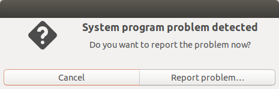

# System problem detected



I run Ubuntu Linux in a virtual machine for development and testing, and get the error message system problem detected way too often. For that case I don't really care about errors in the gnome shell or wayland errors which can be found in */var/crash/*. If you don't want to see this popup again, run these commands:

```shell
sudo service apport stop # Stop the service now
sudo sed -i 's/enabled=1/enabled=0/g' /etc/default/apport # Disable apport service from starting again
```
